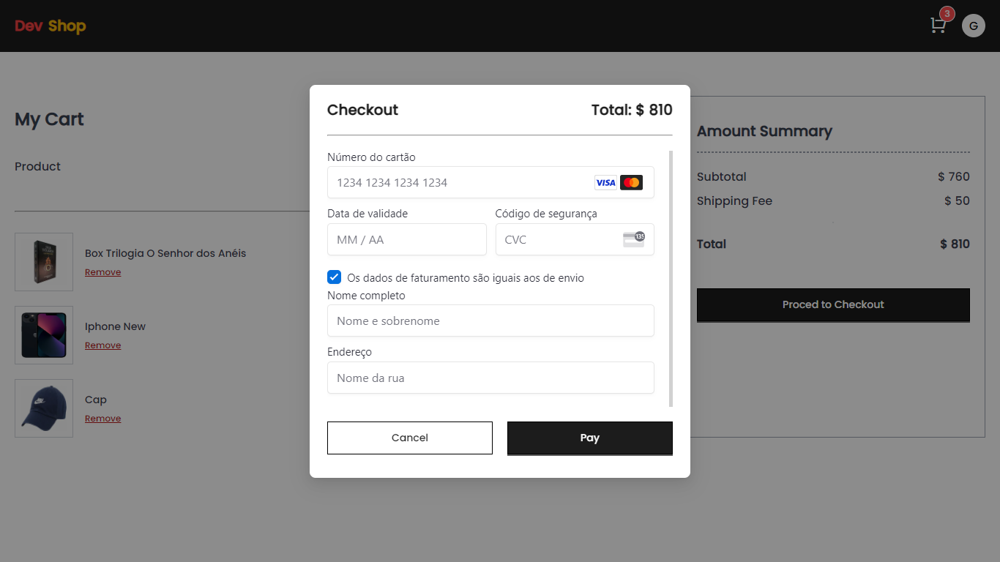

# Dev-Shop

Dev-Shop is an E-commerce platform built using **Next.js 13**, **Ant Design (Ant-D)** for the UI, and **MongoDB** as the database. It integrates Firebase for authentication and Stripe for payment processing.

## Technologies

- **Next.js 13**: React framework for server-side rendering, API routes, and more.
- **Ant Design**: UI library for an elegant and responsive design.
- **MongoDB**: NoSQL database for storing products, users, and orders.
- **Firebase**: Used for user authentication.
- **Stripe**: For handling payments.

## Features

- Responsive design using Ant-D.
- User authentication (Firebase).
- Product management (CRUD with MongoDB).
- Secure payments via Stripe.
- Dynamic cart and checkout system.
  
## Getting Started

### Installation

1. Clone the repository:

   ```bash
   git clone https://github.com/Grazziano/ecommerce-app.git
   ```

2. Install dependencies:

   ```bash
   cd ecommerce-app
   npm install
   ```

3. Create a `.env.local` file and configure the following environment variables:

   ```env
   # MongoDB
   MONGO_URL=mongodb+srv://<user>:<password>@cluster0.0wvmktl.mongodb.net/<databasename>
   JWT_SECRET=<your_jwt_secret>

   DOMAIN=http://localhost:3000

   # Firebase
   NEXT_PUBLIC_API_KEY=<your_firebase_api_key>
   NEXT_PUBLIC_AUTH_DOMAIN=<your_firebase_auth_domain>
   NEXT_PUBLIC_PROJECT_ID=<your_firebase_project_id>
   NEXT_PUBLIC_STORAGE_BUCKET=<your_firebase_storage_bucket>
   NEXT_PUBLIC_MESSAGING_SENDER_ID=<your_firebase_messaging_sender_id>
   NEXT_PUBLIC_APP_ID=<your_firebase_app_id>
   NEXT_PUBLIC_MEASUREMENT_ID=<your_firebase_measurement_id>

   # Stripe
   STRIPE_SECRET_KEY=<your_stripe_secret_key>
   NEXT_PUBLIC_STRIPE_KEY=<your_stripe_public_key>
   ```

4. Run the development server:

   ```bash
   npm run dev
   ```

   Open [http://localhost:3000](http://localhost:3000) to view it in your browser.

## Application Images

<table>
  <tr>
    <td></td>
    <td></td>
  </tr>
  <tr>
    <td></td>
    <td></td>
  </tr>
  <tr>
    <td></td>
    <td></td>
  </tr>
  <tr>
    <td></td>
  </tr>
</table>

## Contributing

Feel free to submit issues and pull requests for improvements or new features.

## License

This project is licensed under the MIT License.
